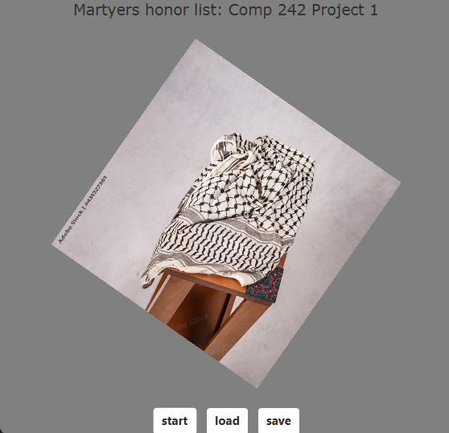
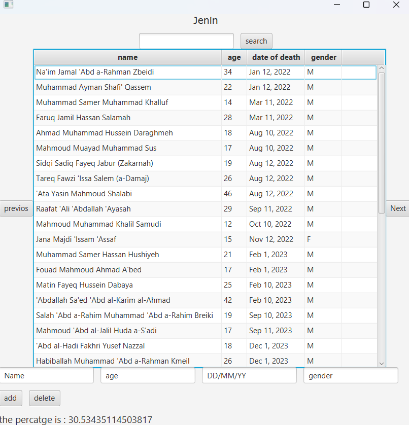
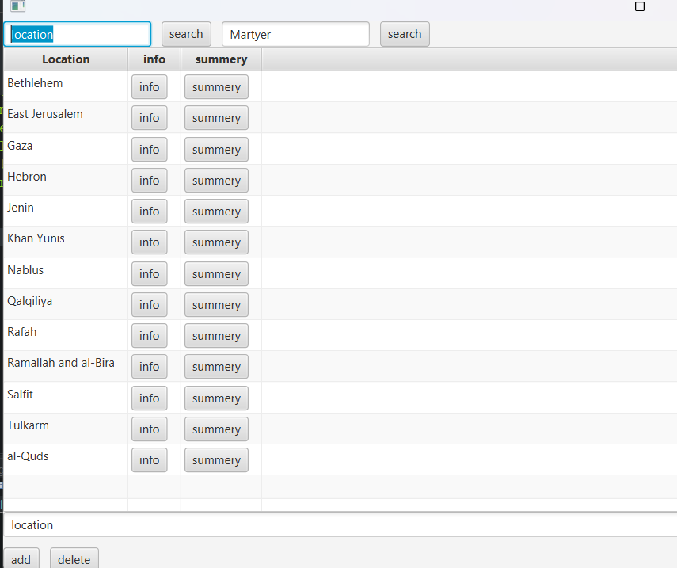
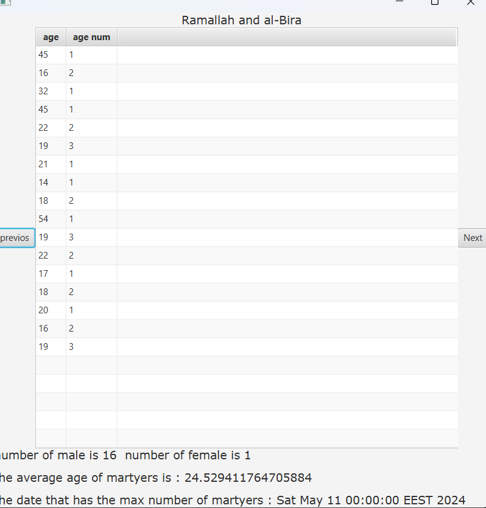
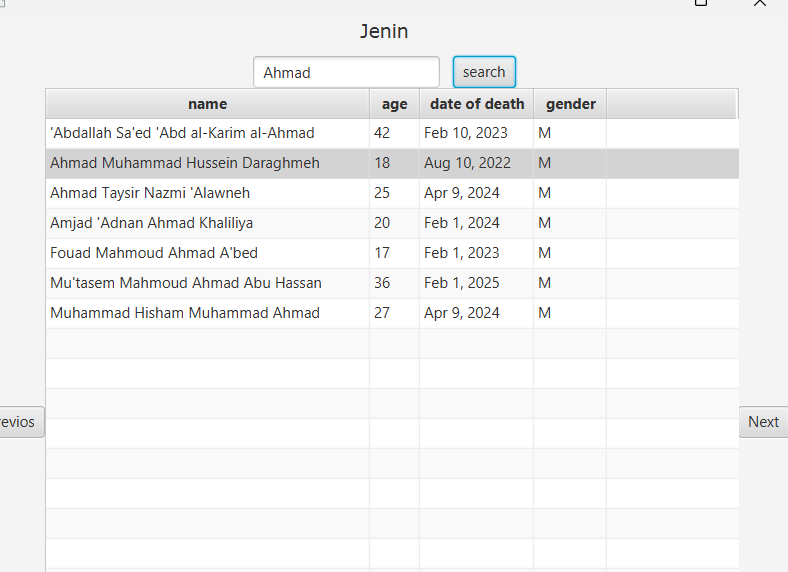

# 🕊️ Martyer Management System – Phase 2 (AVL Trees)




This project is a **Java-based Martyer Management System**. It uses **AVL Trees**, **linked lists**, **stacks**, and **queues** to store, manage, and visualize data of martyrs, including their **location, age, date of death, and gender**.

---

## 📁 Project Structure

Martyer-Management-System-Phase2/
│
├─ src/
│   ├─ Main.java
│   ├─ StartClass.java
│   ├─ MartyesInfo.java
│   ├─ SummeryScreen.java
│   ├─ Location.java
│   ├─ Node.java
│   ├─ LinkedList.java
│   ├─ DoubleNode.java
│   ├─ DoubleLinkedList.java
│   ├─ StackList.java
│   ├─ QueueList.java
│   ├─ DateStack.java
│   └─ other classes...
│
├
│─ main.png
│─ data.png
│
├
│─ btselem.txt
│
├─ README.md
└─ .gitignore

---

## 🧰 Features

1. **Add, Delete, Edit Martyers**  
   - Interactive table to edit Martyer details (name, age, gender, date of death).  
2. **AVL Tree Storage**  
   - Stores Martyers by **name** (`AVlTree1`) and **date of death** (`AvlTree2`) for efficient search and sorting.  
3. **Location Management**  
   - Each location has a tree of Martyers and their death dates.  
4. **Queue and Stack Support**  
   - Queue used for search results.  
   - Stack used for handling multiple Martyers with the same death date.  
5. **Navigation Between Locations**  
   - Next and Previous buttons to cycle through locations.  
6. **Search Functionality**  
   - Search Martyers by name.  
7. **User Interface**  
   - JavaFX-based UI with buttons, text fields, and table view.  

---

## 🖼️ Screenshots


1. **Main Screen / Dashboard**
   - Overview of locations, navigation buttons, and data summary.  
    
    
2. **Data Entry / Martyer Table**
   - Editable table showing martyer name, age, date of death, and gender.
      
   

3. **Summary Screen** – statistics (gender count, average age, max death date) and age frequency table  
     
             
4. **Search Functionality**  
   - Example of search results in the table. 
     

---

## 📜 Logs Example


```

Adding Martyer: John Doe, Age: 25, Date of Death: 01/01/2020, Gender: M
Martyer added successfully to location: Jerusalem
AVL Tree In-Order Traversal (by Name):
Abdallah Aabed, Age: 21, Date: 03/03/2023
John Doe, Age: 25, Date: 01/01/2020
Searching for Martyer: John
Found: John Doe at Location: Jerusalem
Next Location: Bethlehem
Previous Location: Ramallah

````

---

## 📚 Data Structures Used

- **AVL Trees** (`AVlTree1` and `AvlTree2`) – balanced binary search trees for fast insertion, search, and sorting.  
- **Linked Lists** (`LinkedList`, `DoubleLinkedList`) – sequential storage for traversal and table display.  
- **Stack** (`StackList`) – for handling multiple Martyers with the same death date.  
- **Queue** (`QueueList`) – temporary storage for search results.  

---

## ⚙️ How to Run

1. Clone the repository:

```bash
git clone https://github.com/abdallahabed/Martyer-Management-System-Phase2.git
````

2. Open in your IDE (IntelliJ/Eclipse/NetBeans).
3. Run `StartClass.java` as a JavaFX Application.
4. Ensure `btselem.txt` is in the `data/` folder.

---

## 🔧 Technologies Used

* Java 17+
* JavaFX for GUI
* Text file input/output for persistent data

---

## 💡 Notes

* Supports multiple Martyers with the same date of death.
* Real-time table updates with editable cells.
* AVL trees guarantee **O(log n)** search and insertion.
* Easily extendable to add more attributes or locations.

```


